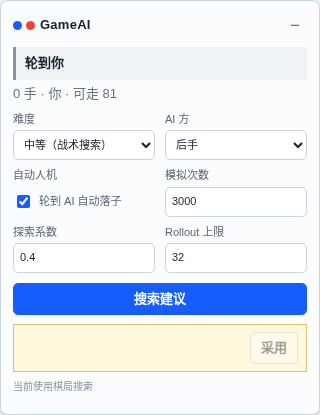
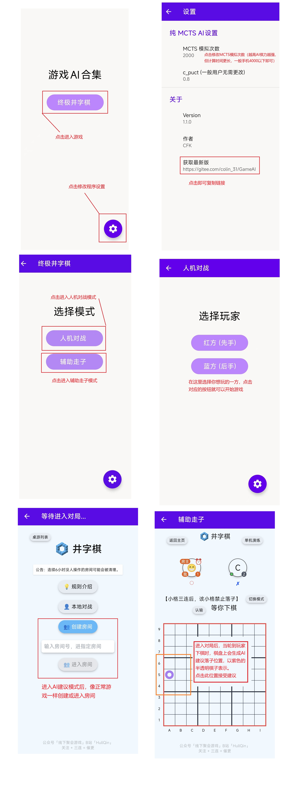

# GameAI

GameAI 是面向终极井字棋（Ultimate Tic-Tac-Toe）的 AI 项目。**当前开发主线已转为 Chrome 扩展**：它直接在 [game.hullqin.cn/jzq](https://game.hullqin.cn/jzq?p=) 的本地棋局中提供走子建议和自动人机对弈。Android app 仍保留为可用客户端与 JNI 参考实现，但新功能和日常使用优先进入插件端。

## Chrome 扩展（当前主线）

扩展使用 `majority-utt-v1` 规则：每个 3x3 小棋盘按普通三连判定胜负；大棋盘只比较已赢小棋盘的数量，先取得不可逆严格多数的一方获胜。大棋盘横、竖、斜三连没有胜负含义。

扩展只在 `https://game.hullqin.cn/jzq` 的本地棋局生效，不会接管 `/jzq/<room>` 联机房间。

### 安装

仓库已包含扩展运行代码、WASM 搜索引擎和转换后的模型资源。若 `extension/models/utt_majority_v1_torch_teacher6000_512_hard.bin` 缺失，先在仓库根目录生成它：

```shell
python scripts/extension/export_prior_model.py --force --json
```

如修改了 `extension/wasm/engine.c`，重新构建 WASM：

```shell
npm run build:extension:wasm
```

然后在 Chrome 中：

1. 打开 `chrome://extensions`，开启“开发者模式”。
2. 点击“加载已解压的扩展程序”，选择仓库中的 `extension/` 目录。
3. 打开 [终极井字棋本地棋局](https://game.hullqin.cn/jzq?p=)。右下角会出现 GameAI 面板。

需要生成发布包时执行：

```shell
npm run package:extension
```

该命令生成 `dist/gameai-extension.crx`。更完整的模型、WASM、性能和发布说明见 [extension/README.md](./extension/README.md)。

### 使用




1. 在“难度”中选择搜索模式；“中等（战术搜索）”是默认配置。
2. 选择 AI 为先手或后手。勾选“轮到 AI 自动落子”后，轮到指定一方时会自动搜索并落子。
3. 需要人工控制时，取消自动人机，点击“搜索建议”。扩展会标出建议着；确认后点击“采用”。也可通过 `Ctrl+Shift+G`（macOS 为 `MacCtrl+Shift+G`）搜索当前局面。


搜索完成后，面板会显示建议坐标、搜索评价和耗时。底部的 `WASM 搜索` 表示当前搜索走浏览器内的 WASM 引擎；若浏览器不支持或资源加载失败，面板会明确显示 `JS fallback` 及原因。

| 难度 | 内部模式 | 默认行为 |
| --- | --- | --- |
| 简单（均匀搜索） | `uniform` | 均匀先验与随机 rollout。 |
| 中等（战术搜索） | `tactical` | 优先处理立即多数胜、阻止对手多数胜与小棋盘成棋。 |
| 困难（AI 模型） | `native-prior` | 加载策略模型，在 WASM 中执行 CNN 推理与 MCTS。 |

如果页面 URL 带有 `r=1`，扩展会提示切换到 `r=0`；这是为了避免网页规则与本项目的 `majority-utt-v1` 规则不一致。

## Android app（保留支持）

Android app 仍可从主页进入终极井字棋模式，提供 AI 对人和 AI 建议入口，并通过 WebView 展示棋盘、JNI 调用本地搜索。它不再是当前功能开发的主线；日常对弈与最新能力请优先使用 Chrome 扩展。

可直接安装 release 中的 APK。需要自行构建时，将项目导入 Android Studio 后运行 `app/` 模块即可。

### 使用指南



## Native 与 Python 工具

共享 C++ 核心和 Python 脚本仍用于搜索验证、benchmark、调参与本地 humanplay。建议在独立的 `gameai` conda 环境中运行：

```shell
conda activate gameai
python -m pip install .
```

需要单独验证 Python binding 时：

```shell
cmake -S native -B build/native -DLINUX_BUILD=ON -DENABLE_MCTS_PURE=ON -DENABLE_PYTHON_BINDINGS=ON -DCMAKE_BUILD_TYPE=Release
cmake --build build/native -j
```

常用工具命令：

```shell
python -m scripts.mcts.decide_params --trials 10 --games-per-side 2
python -m scripts.mcts.benchmark --config configs/benchmark/benchmark_config.json5
python -m scripts.humanplay.server start --config configs/humanplay/humanplay_config.json5
python -m scripts.humanplay.server stop
```

## 目录

- `extension/`: Chrome MV3 扩展，当前开发主线。
- `app/`: Android app 与 JNI 包装，保留支持。
- `native/`: 共享 C++ 游戏逻辑、MCTS 与 Python bindings。
- `scripts/`: 模型导出、扩展打包、benchmark、调参与 humanplay 工具。
- `docs/images/`: README 中的真实 Chrome 扩展渲染截图。
- `img/`: Android app 使用说明图片。
