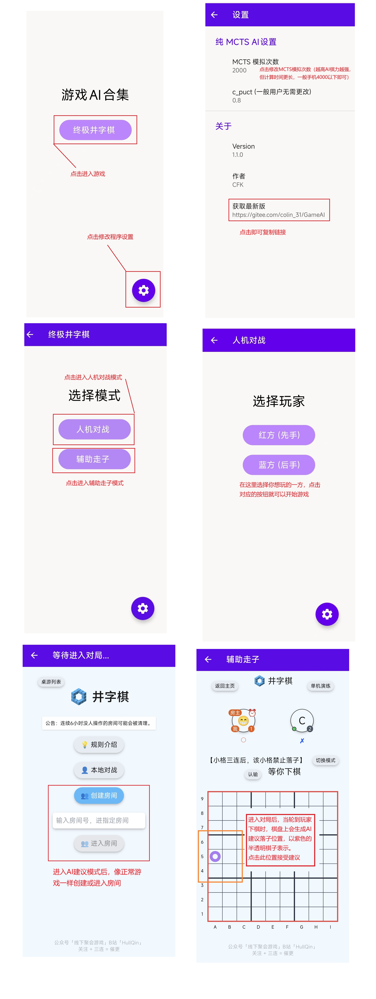

# GameAI
基于 cpp 和 libtorch，制作不同算法的游戏 ai，同时提供可供 AI 运行的安卓界面

计划开发的游戏：[终极井字棋](https://game.hullqin.cn/jzq)，[璀璨宝石](https://game.hullqin.cn/ccbs)

现在已开发完成：终极井字棋，只支持一种规则：「小井字棋」内部形成三连后禁止继续下棋，占领「小井字棋」数量更多的玩家胜利

如果需要 chrome 插件或者终极井字棋的其他规则，可以在 gitee 上 pull request 或者提 issue

**注意：**项目正在开发中，可能会有较大的变化

## 运行项目

### 只编译游戏核心逻辑

现在开发的纯 MCTS AI 只依赖标准库，安装 Cmake 即可正确编译

如果需要使用代码中简单的 humanplay，需安装 jsoncpp (只支持 apt 安装到默认路径)

AI MCTS 基于 libtorch 开发，目前尚未开发完成

纯 MCTS 编译流程：

```shell
# 初次编译，安装jsoncpp
sudo apt-get install libjsoncpp-dev   # headers + .so
# 在 GameAI/app/src/main/cpp/UTT 目录下
rm -rf build/ # 可选
cmake -B build -DLINUX_BUILD=ON -DENABLE_MCTS_PURE=ON -DCMAKE_BUILD_TYPE=Release
cmake --build build -j
# 开始人机对战
./build/humanplay/gameplay -config ./humanplay/humanplay_config.json5
```

一并编译benckmark和调参工具：

```shell
# 在 GameAI/app/src/main/cpp/UTT 目录下
rm -rf build/ # 可选
cmake -B build -DLINUX_BUILD=ON -DENABLE_MCTS_PURE=ON -DENABLE_TOOL=ON -DCMAKE_BUILD_TYPE=Release # 构建调参工具
cmake -B build -DLINUX_BUILD=ON -DENABLE_MCTS_PURE=ON -DENABLE_BENCHMARK=ON -DCMAKE_BUILD_TYPE=Release # 构建benchmark
cmake --build build -j
# 运行 benchmark
./build/benchmark/benchmark -config ./benchmark/benchmark_config.json5
# 运行自对弈：./build/tool/self_play <n_playout1> <c_puct1> <n_playout2> <c_puct2>
# 例：
./build/tool/self_play 1000 0.8 2000 0.8

# 运行调参脚本
cd tool
uv venv
uv pip install -r requirements.txt
source .venv/bin/activate
python decide_params.py
```

下面是目前被弃用的编译脚本：

```shell
# 编译 train 的 release 版本：
cmake -B build -DENABLE_TRAIN=ON -DENABLE_INFER=OFF -DCMAKE_BUILD_TYPE=Release
cmake --build build -j
cmake -B build -DENABLE_TRAIN=OFF -DENABLE_INFER=ON -DCMAKE_BUILD_TYPE=Release

# 运行：
cd build
./build/train/train -config /root/Desktop/AIGame/train/train_config.json5
./build/train/train -config <config_file>

./build/infer/infer -config <config_file>
./build/infer/infer -config /root/Desktop/AIGame/infer/test_config.json5

# train编译流程：
rm -rf build/
cmake -B build -DENABLE_TRAIN=ON -DCMAKE_BUILD_TYPE=Release
cmake --build build -j
./build/train/train -config /root/Desktop/AIGame/train/train_config.json5

# 测试train编译流程：
rm -rf build/
cmake -B build -DENABLE_TRAIN_TEST=ON -DCMAKE_BUILD_TYPE=Release
cmake --build build -j
./build/train/train_test -config /root/Desktop/AIGame/train/train_test_config.json5

# 测试train编译流程：
rm -rf build/
cmake -B build -DENABLE_TRAIN_TEST=ON -DCMAKE_BUILD_TYPE=Debug
cmake --build build -j
./build/train/train_test -config /root/Desktop/AIGame/train/train_test_config.json5
```

### 安卓程序

安装 release 中的 apk 即可

如果需要自己编译，将项目导入 Android Studio 即可

#### 使用指南



## 文件目录说明

```cpp
GameAI/ // 只显示正在使用中的文件   
├── .gitignore
├── LICENSE
├── Readme.md
├── Readme_developer.md // 开发者readme，存储一些暂时弃用的功能
├── app
│   ├── build.gradle.kts // 构建配置
│   ├── proguard-rules.pro
│   └── src
│       └── main
│           ├── AndroidManifest.xml // 记录应用权限和activity结构
│           ├── cpp
│           │   └── UTT
│           │       ├── CMakeLists.txt
│           │       ├── benchmark
│           │       │   ├── CMakeLists.txt
│           │       │   ├── benchmark_config.json5 // 测试配置
│           │       │   └── speed_test.cpp // 速度测试
│           │       ├── core
│           │       │   ├── CMakeLists.txt
│           │       │   ├── MCTS
│           │       │   │   ├── TreeNode.cpp // MCTS 树节点实现
│           │       │   │   ├── TreeNode.h
│           │       │   │   └── mcts_pure.h // MCTS算法
│           │       │   ├── base_game.h // 游戏基类接口
│           │       │   ├── json5cpp.h // 解析json5 (依赖 jsoncpp)
│           │       │   ├── utt.cpp // 终极井字棋游戏逻辑
│           │       │   └── utt.h
│           │       ├── humanplay
│           │       │   ├── CMakeLists.txt
│           │       │   ├── gameplay.cpp // 简易人机对战实现
│           │       │   └── humanplay_config.json5 // 人机对战配置文件
│           │       ├── interface
│           │       │   ├── CMakeLists.txt
│           │       │   └── mcts_pure_bridge.cpp // 安卓使用的 JNI 接口
│           │       └── tool
│           │           ├── CMakeLists.txt
│           │           ├── decide_params.py // 调参脚本
│           │           ├── requirements.txt // 脚本依赖
│           │           └── self_play.cpp // 参数自对弈检验
│           ├── java
│           │   └── com
│           │       └── aiprojects
│           │           └── gameai
│           │               ├── MainActivity.kt
│           │               ├── Native_objects_AIHuman.kt // UTT 使用的 native_functions 封装
│           │               ├── SettingActivity.kt
│           │               ├── UTTAISuggest.kt
│           │               ├── UTTAIvsHuman.kt
│           │               ├── UTTHumanPlayerSelect.kt
│           │               ├── UTTModeSelect.kt
│           │               └── native_functions.kt // JNI 接口
│           └── res
│               ├── drawable // 使用的图标
│               │   ├── baseline_arrow_back_24.xml // 返回键
│               │   └── baseline_settings_24.xml // 设置键
│               ├── layout // 界面布局
│               ├── mipmap-... // 存储不同清晰度的应用图标
│               ├── values // 部分常量
│               └── xml
│                   └── root_preferences.xml // 设置界面
├── build.gradle.kts // gradle 配置
├── changelog.txt
├── gradle
│   ├── libs.versions.toml
│   └── wrapper
│       ├── gradle-wrapper.jar
│       └── gradle-wrapper.properties
├── gradle.properties
├── gradlew
├── gradlew.bat
├── img // md 使用的图片
└── settings.gradle.kts
```


## 开发指南

### 添加新游戏
在项目中增加文件，实现 base_game.h 定义的接口和自己的 humanplay 逻辑和安卓界面，同时相应修改 cmake 编译文件即可，可以参考 utt.h 和 utt.cpp 的实现